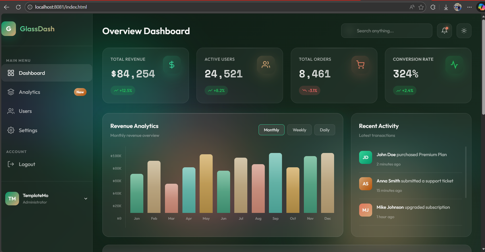
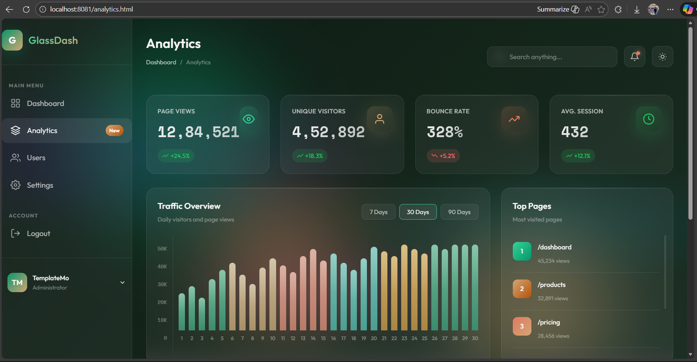
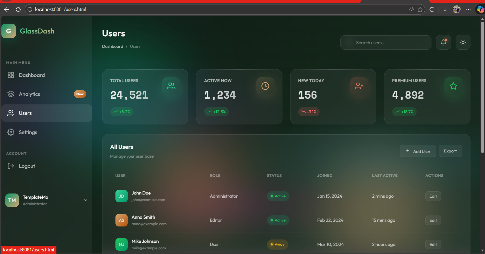
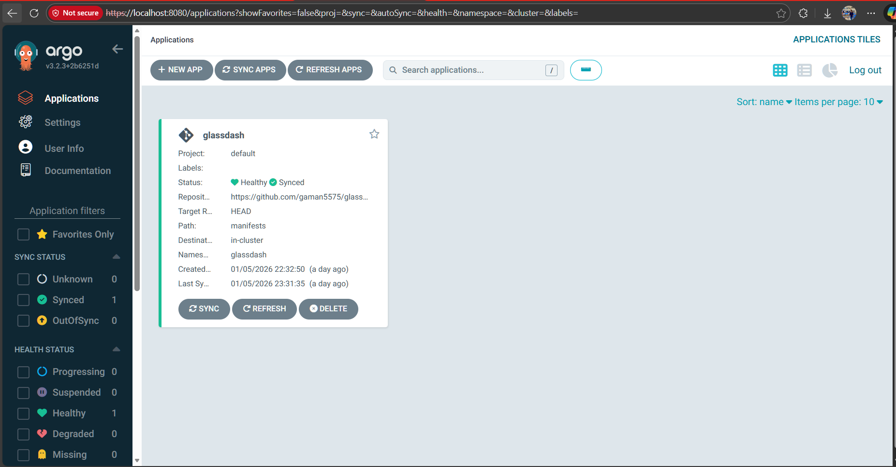
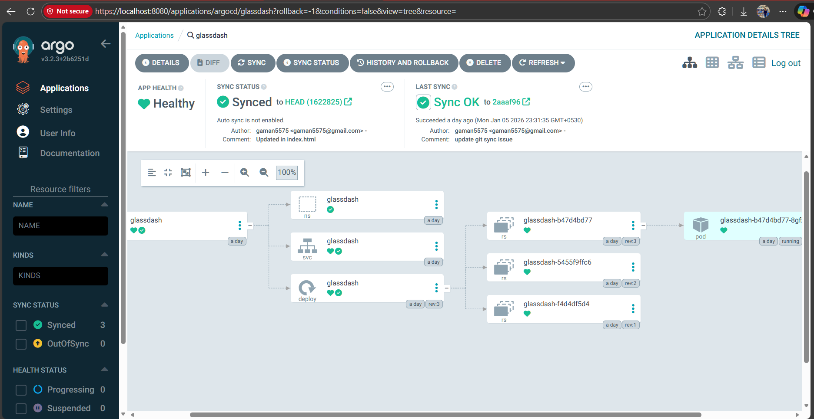
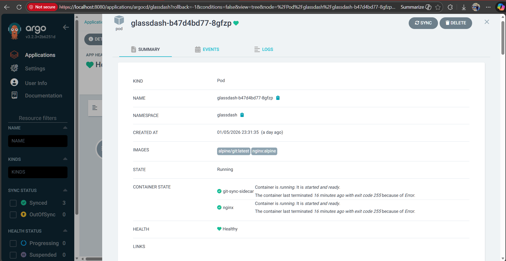

# GlassDash GitOps Deployment 🚀

Multi-page glassmorphism admin dashboard deployed declaratively using **ArgoCD** on Minikube with **zero-downtime continuous delivery**.

**Live Demo**: Access via `kubectl port-forward` on Minikube (local only).

**GitHub Repo**: https://github.com/gaman5575/glassdash-gitops-deployment

## Features
- 6+ interconnected HTML pages (Dashboard, Analytics, Users, Settings, Login, Register)
- Shared CSS/JS for consistent styling and interactivity (glassmorphism theme)
- Declarative GitOps with ArgoCD managing infrastructure manifests
- **Zero-downtime code updates**: Custom git-sync sidecar pulls from Git every 30s and syncs files live — no pod restarts needed for HTML/CSS/JS changes
- Scalable pattern using shared `emptyDir` volume and sidecar container

## Deployed Dashboard Screenshots

### Homepage (Overview Dashboard)


### Analytics Page


### Users Page


## ArgoCD GitOps Proof

### Application Status (Synced & Healthy)


### Resource Tree (Deployment, Pod with Sidecar)


### Pod Details (nginx + git-sync-sidecar Running)


### Events (Successful Syncs)


## Zero-Downtime Update Flow
Push changes to `public/` folder → sidecar auto-syncs → refresh browser → updated instantly!

(Example: Add text to `index.html`, commit/push → visible in ~30s without downtime.)

## Architecture

```mermaid
graph TD
    A[GitHub Repo public code and manifests] --> B[git sync sidecar git pull every 30s]
    B --> C[emptyDir Volume usr share nginx html]
    C --> D[Nginx Container serves live files]
    E[Browser] --> D
    F[ArgoCD] --> G[Deployment Pod Service Namespace]

### Setup Instructions (Local Minikube)

1. Start Minikube + install ArgoCD.
2. Create ArgoCD Application pointing to manifests/ path.
3. Port-forward the Service:Bash
        `kubectl port-forward svc/glassdash -n glassdash 8081:80`
4. Open http://localhost:8081

Built by Aman Kumar – Demonstrates advanced GitOps with sidecar for zero-downtime static site delivery.